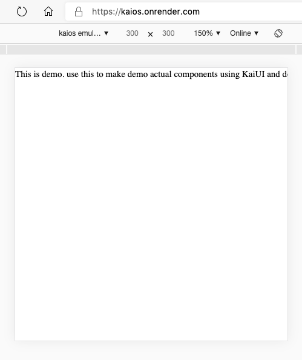
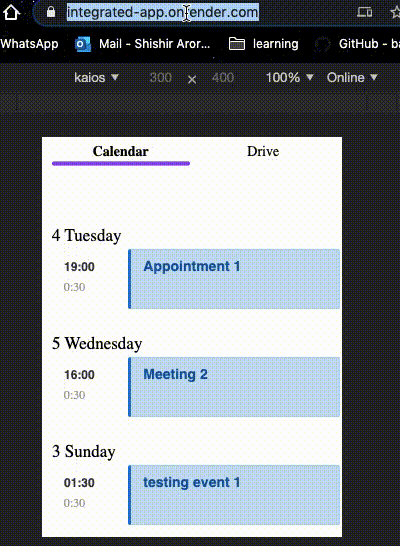
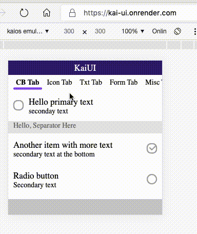

Demo Video Links:

https://microsoft.sharepoint-df.com/:v:/t/outlookonkaiosfc/EVIVTswdeVlLu2d1L3dkENYBY6zq6DJuJD42p6qwtjMIhA?e=6uPv6Z

https://microsoft.sharepoint-df.com/:v:/t/outlookonkaiosfc/EYmBK52iXWBPknxcGBkKWsIBTyGK07Di97Pd443UeNqxHA?e=Wg1vAk

 
 npm install
 
steps to run:
1) in device/simulator
    npm build
    then upload build folder to simulator/phone General Engg
    
2) in browser with kai-ui demo
  
    npm run start:kai-ui

3)  in browser with actual components (to be built)
  
    npm run start:demo
  
4) in browser with Outlook+kaiui+services integrated
    npm run start
    
    
5)  
    ci-cd Hosted urls
        with demo components to be build:
            https://kaios.onrender.com
            
            
        with integrated app
            https://integrated-app.onrender.com
            
        with kai ui
            https://kai-ui.onrender.com
            
            
6) every pr against master, will have a deploy link generated

7)ci-cd service 
   https://dashboard.render.com/
    
 

 
